# Capstone_44688
Capstone Project for the MS Data Analytics Program

The report was written in overleaf editor. You can access the report, and the latex editor with the link below.

https://www.overleaf.com/read/zgyxrgsvgnbg#cc7944

### Module 1

Introduction was formed. The issue was identified that this project was going to be working with Westminster College Data, and it was going to be used to predict if a Westminster student would be retained or not. The domain was identified as Higher Education. 

### Module 2

Went through the data collection process. Wrote a script to get data from two databases that are specific to my college. Data was exported from the SQL environment into a .csv file. 

### Module 3

After the data was collected, the cleaning process took place. Null values were replaced with the average in the numerical columns. Other categories were changed into binary variables, after doing some Exploritory data analysis in the next module, returned to this stage and fixed the outliers for GPA that appeared to be entered incorrectly at 0 for high school.

### Module 4

In this section, exploritory data analysis occured. Several charts such as box plots, histograms, and heat charts were created to get a visual of our data, and see some initial insights and how the features related to each other.

### Module 5

We begin to look at various models for the predictive analysis section. Here we looked at a linear regression model, a decision tree model, a neural net model, and an ADA boosted model. The results were printed along with each model.

### Module 6

In this section, the results are discussed. The best model was chosen which was the ADA Boosted Model. Even though it was the top performing model, it was only successful about two thirds of the time. Some items to think about moving forward are expanding the data set size, as this one had a range of 10 years. Also, would add in financial data from our Financial Aid system such as household income, scholarships received, loans taken out, and other grants. Ideally we would like to see this added in to see if we can get the models performance to increase.

# Westminster College: A Retention Prediction Model

### Author: Ryan Smith

### Abstract

In the ever competing world for enrollment in higher education, retention is becoming a primary focus. This project examines building a model to predict if a student will not be retained at Westminster College. The study will focus on a variety of factors for a student to see if they will churn from the institution. The data was sourced from the local databases, and cleaned using Python. Several models were compared (Linear Regression, Decision Tree, Neural Net, ADA Boosted) from the sklearn library. There appeared to be a correlation between several features and retention, but the results were not strong in the models. More features should be explored, such as household income and aid received to see if the models can be enhanced.

### Project Goal

For this project, we want to see if retention can be predicted at Westminster College based on the selected data points, and a machine learning model. As linked above the project itself can be see from the [Overleaf](https://www.overleaf.com/read/zgyxrgsvgnbg#cc7944) site.

### Introduction

This project will be looking to successfully predict if a student is at risk of being retained. We can use this data with our Student Success Center so that they can set up an intervention, or take the appropriate actions to ensure they can help the student persist. After gathering all the data to analyze, a model will be built and trained on train data, and then tested. After the model is completed, we can discuss the results and see how the model performed. 

### Data Sourcing

All the data was sourced from our own databases. There were two databases one that is our student information system, and the other for enrollment. They were joined with student id number. SQL server was used to collect the data from the databases. Once the data was retreived from the databases, it was exported to a .csv file so that Python could be used for the data cleaning and analytics. The data sets with anonymized student id can be found in each module folder. 

### Data Cleaning

We wanted to take a look at what the data was looking like. There were several things to look at first. One was to remove duplicates, the other was to fix and replace null values. The data was read into Python using a pandas dataframe. Below are a couple snips of the code used to analyze the data. 

* Checking columns for null data and replacing with the mean
  
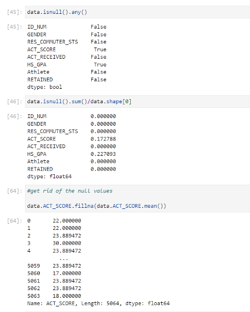

Once all the duplicates were removed and the null values replaced with the averages, it was time to start exploring the data.

### Exploritory Data Analysis

In this section we wanted to see how the data was looking, if there were any outliers that needed further cleaning, and how the data was initialy grouping togehter. Below are some of the exploring that was done. The matplotlib was used to create the charts. 

-- Looking for outliers --
* A Box plot looking at the ACT Scores. This one shows the data falls within a reasonable range.

  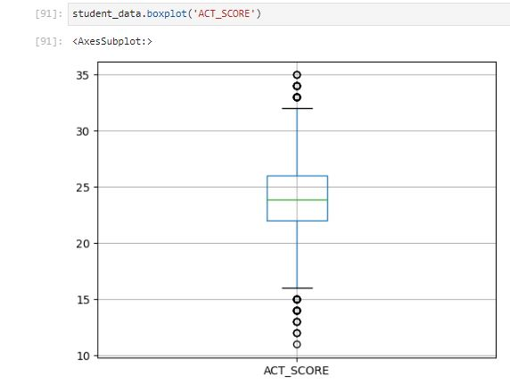

* Next we wanted to see how the scores grouped togehter with a histogram. It was a fairly normal distribution with a higher bucket where the nulls were replaced with the average.

  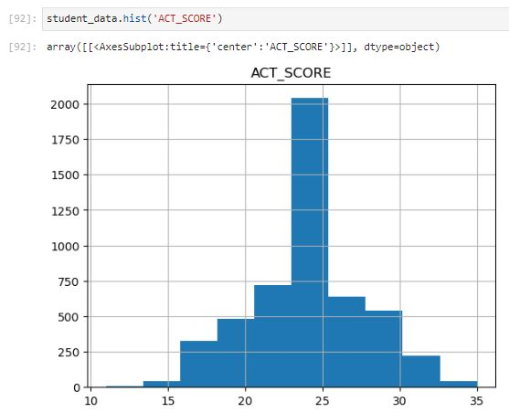

* Similarly the high school GPA was examined. We looked at a box plot of those. The data was also pretty normal, nothing out of the low range, and the upper range was from high schools that used weighted GPA scales.

  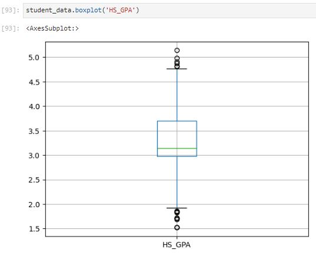

* Simalraly we wanted to see how the GPA grouped togehter with a histogram like ACT scores. It was a more of a left skewed distribution again with a higher bucket where the nulls were replaced with the average.

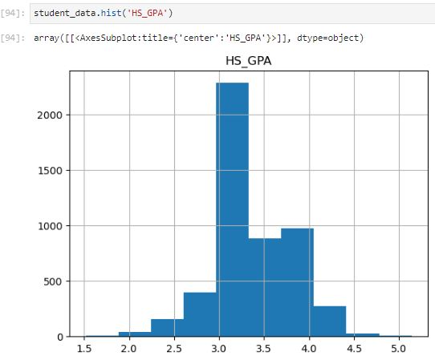

After looking at the data above, it was time to start looking at how the data fit together. A heat chart and correlation chart were created to see how the correlated the features were with each other and importantly retention. One was ran for ACT Scores and on for ACT Test received. The latter shows a negative correlation with retention as you will see in the images below. The models going forward will focus on ACT Score going forward.

* ACT Scores Correlation chart and heat map. As observed below, all features had a least a small positive correlation with the dependent variable of retention.

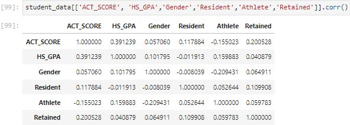
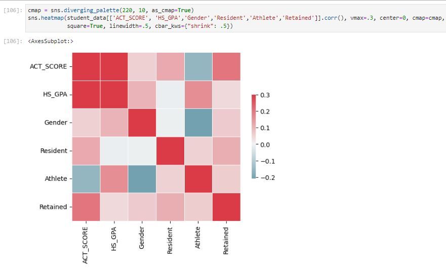

* ACT Received Correlation chart and heat map. Again, here you can see the negative correlation between the test received and retention. All other variables as seen before.

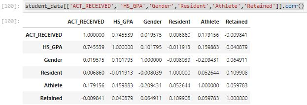
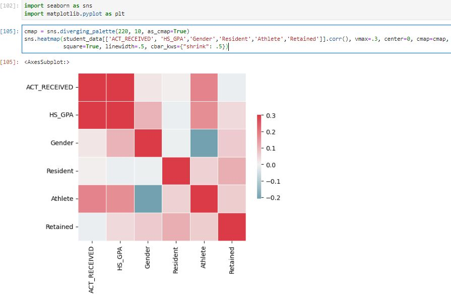

### Model Building

There were 4 models ultimately built and tested. All used the sklearn library in Python. Each used the train/test split for the data set. 20 percent of the data was used in the test set. The models that were built were a Linear Regression model, Decision Tree, Neural Net, and ADA boosted. The code for each model can be found in module 5 folder, and the final iteration in the module 6 folder. The linear regression model performed by far the worst and was eliminated from contention. The other three models can be seen compared below. We can see that the Decision Tree model performed the best on the train, but the worst on the test, showing that it was overfitting. From the other two they performed very close, with the slight edge going to the ADA model, even though it still was only at about a 67% accuracy overall. 

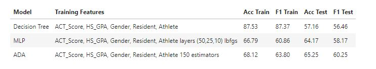

### Results

As seen a bit above, the ADA model was the best performing. Even though it was the best, it did not provide us with conclusive results at this time. It may be a start for adminstistration to look at as it is better a bit over half the time, so any identified student at risk of churn would be helpful. Below we can see how the model performed along with it's confusion matrix.

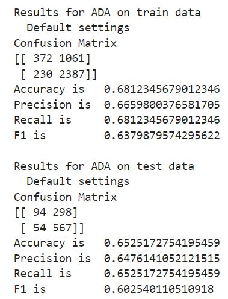

Another item that we can observe, was one of the first thing produced by each model, which was a confusion matrix. Below we can see the results as shown in that matrix. Note that the model predicted 94 or 9 percent True Positives (not retained), 298 or 29 percent False Positive (as retained but were actually not), 54 or 5 percent False Negative (as not retained but were actually retained), and finally 567 or 56 percent True Negative (as retained).

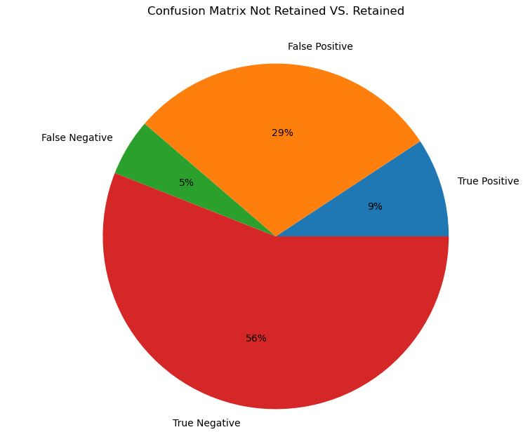

### Discussion

The initial problem that was focused on, was to see if a machine learning model could accurately predict if a student at Westminster would not be retained. There were four models tested to see how they would function on the features that were selected: ACT score, High school GPA, Athlete, Gender, Resident. The top performing model (ADA Boosted) was only able to identify the students accurately a little more than two thirds of the time. Although this could be helpful to the administration, it would be best to examine additional features to try and better the model's accuracy. 

One limitation of the current project, was the size of the data set. The data set focused on a ten year span of students at Westminster College. For future research, the pool should be expanded to account for a larger time period that the database houses. This would give additional data points to work with. Another limitation of this project, was the lack of financial data. Affordability to higher education can be a crucial factor, but at the time of this project, access was not available for household income, or financial aid packaging.

As discussed in the limitations section, much of that would be beneficial to see in the future work of this study. The database contains student data as far back as 1999. Expanding the data set would be the first thing to easily generate aa larger sample size for the data set. To go any further back, it would have to examined where data was stored prior to the move to the current database system, however, any farther back than that may not necessarily be timely the further back we go. Another recommendation would be working with financial aid, and being able to gather data from their system. Being able to add in data about household income and student packaging to gather loan data as well as scholarships and grants would be useful to see how it would affect the model's performance. Additional data points could be identified, such as first generation student, and added into the data sets features, or swapped out entirely, if it is determined to be much more correlated. Taking into the model these considerations would be interesting to see how the model performs in the future

### References

1. Act scores drop for 6th straight year (October 2023), https://www.northwestmoinfo.
com/local-news/act-scores-drop-for-6th-straight-year/
2. Current term enrollment estimates (May 2023), https://nscresearchcenter.org/
current-term-enrollment-estimates/
3. Castillo, E.: Act scores hit 30-year low (October 2023), https://www.bestcolleges.
com/news/act-test-scores-hit-30-year-low
4. Knox, L.: Leveling off on the bottom (May 2023), https://www.insidehighered.com/
news/admissions/traditional-age/2023/05/24/leveling-bottom
5. Seltzer, R.: Birth dearth approaches (December
2020), https://www.insidehighered.com/news/2020/12/15/
more-high-school-graduates-through-2025-pool-still-shrinks-afterward

